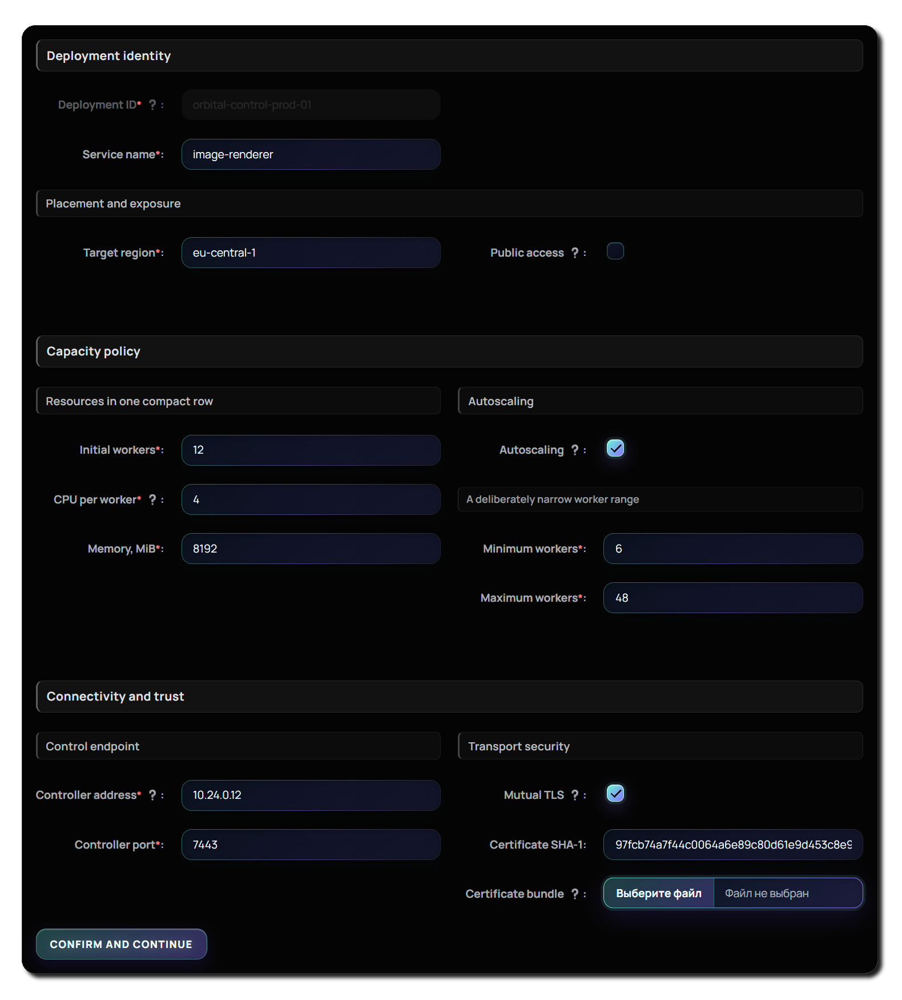

# Formutate

A data-first React framework for building type-safe forms from declarative schemas.

> Formutate is currently in `0.x`. Its public API may change between minor releases.

## Try it out!

1. Clone the repository `git@github.com:losdayver/formutate.git`
2. Install dependencies with `npm install`
3. run `npm run watch-dev`, this will launch the preview app which will be available at `http://localhost:5173/`



## Installation

```bash
npm install formutate
```

Formutate supports React 18 and 19.

## Basic usage

```tsx
import { DataForm, builtinComponentFactory, type FormSchema } from "formutate";
import "formutate/styles.css";

const schema = {
  name: {
    title: "Name",
    component: "input",
    required: true,
  },
  age: {
    title: "Age",
    component: "inputNum",
  },
} as const satisfies FormSchema;

export const ProfileForm = () => (
  <DataForm
    schema={schema}
    componentFactory={builtinComponentFactory}
    initialData={{ name: "Ada", age: 36 }}
    onConfirm={(data) => console.log(data)}
  />
);
```

The combined stylesheet is optional. Omit it when supplying your own styles or component factory.

The built-in controls and the form layout can also be styled independently:

```tsx
// BuiltinButton, BuiltinCheckbox, and BuiltinInput styles
import "formutate/intrinsic.css";

// Form layout, hints, validation messages, and states
import "formutate/data-form.css";

// Header styles
import "formutate/data-form-headers.css";
```

Import either file, both files, or neither. Do not additionally import `formutate/styles.css` when both individual files are already imported.

## Custom layout

Use `GridGroup`, `GridItem`, and `GFI` as children of `DataForm` to define a custom grid layout.

```tsx
import { DataForm, GFI, GridGroup, builtinComponentFactory } from "formutate";

const schema = {
  name: {
    title: "Name",
    component: "input",
    required: true,
  },
  age: {
    title: "Age",
    component: "inputNum",
    validator: (val) => {
      const valid = val >= 0 && val <= 120;
      if (valid) return true;
      return {
        severity: "error",
        message: "Age is incorrect",
      };
    },
  },
  address: {
    title: "Address",
    component: "input",
  },
  socialSecurity: {
    title: "Social security",
    component: "input",
  },
} as const satisfies FormSchema;

<DataForm schema={schema} componentFactory={builtinComponentFactory}>
  <GridGroup header="Profile">
    {GFI("name")}
    {GFI("age")}
  </GridGroup>
  <GridGroup split header="Additional info">
    {GFI("address")}
    {GFI("socialSecurity")}
  </GridGroup>
</DataForm>;
```
For more advanced examples see `src\dev\previewApp\previewApp.tsx`

## Package format

Formutate is published as an ESM-only package with TypeScript declarations.

## License

[MIT](./LICENSE)
